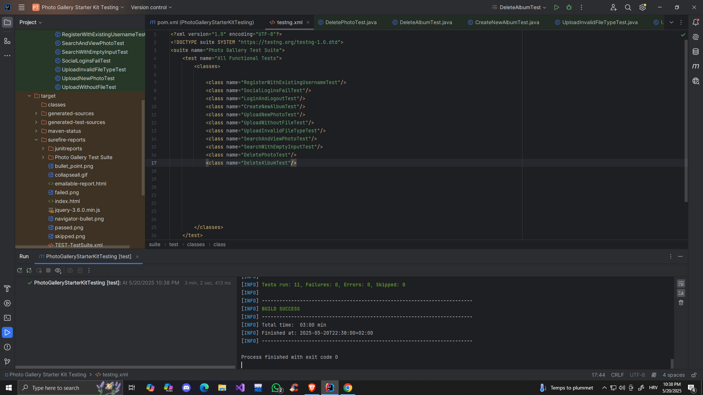
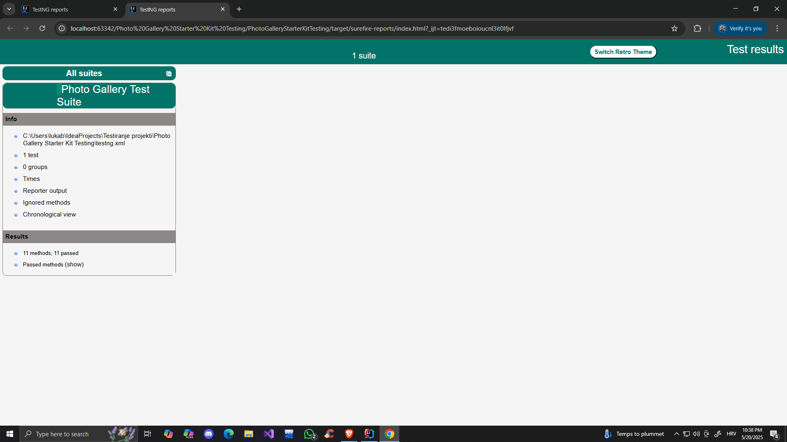

# Photo Gallery Starter Kit – Automated Testing

This project contains automated tests for the demo web application:  
**http://demo.baasic.com/angular/starterkit-photo-gallery/main**

All core functionalities have been tested using Selenium and TestNG.

---

## 🚀 Technologies Used

- **Java JDK 21**
- **Maven** (build + dependency manager)
- **TestNG** (test framework)
- **Selenium WebDriver** (browser automation)
- **ChromeDriver v136** (for Chrome v136.0.7103.114)
- **IntelliJ IDEA** (recommended IDE)

---

## 🛠️ Project Setup Instructions

### 1. Clone / Download the Repository

```bash
git clone https://github.com/your-username/Photo-gallery-testing.git
cd Photo-gallery-testing
```

Or manually unzip if you're using a ZIP archive.

### 2. Install Java 21 (JDK)

Ensure JDK 21 is installed and configured:

```bash
java -version
# Output should show version 21.x
```


### 3. ChromeDriver Setup

Ensure that your local **Chrome browser version** matches the **ChromeDriver version**.

For this project:
- **Chrome version:** 136.0.7103.114
- **ChromeDriver version:** 136.0.7103.94

Download from: https://chromedriver.chromium.org/downloads  
Place it at: `C:\drivers\chromedriver.exe`
Important: Add this path to your system's Environment Variables under the PATH variable so ChromeDriver can be found globally by Selenium.

Make sure the path is correct in the test class:

```java
System.setProperty("webdriver.chrome.driver", "C:\\drivers\\chromedriver.exe");
```

### 4. Project Structure

```
Photo Gallery Starter Kit Testing/
├── pom.xml
├── testng.xml
├── README.md
└── src/
    ├── main/
    └── test/
        ├── java/
        │   ├── LoginAndLogoutTest.java
        │   ├── CreateNewAlbumTest.java
        │   ├── UploadNewPhotoTest.java
        │   ├── UploadWithoutFileTest.java
        │   ├── UploadInvalidFileTypeTest.java
        │   ├── SearchAndViewPhotoTest.java
        │   ├── SearchWithEmptyInputTest.java
        │   ├── DeletePhotoTest.java
        │   ├── DeleteAlbumTest.java
        │   ├── SocialLoginsFailTest.java
        │   └── RegisterWithExistingUsernameTest.java
        └── images/
            └── japan.jpg

```

---

## ✅ How to Run the Tests

### Option 1: Run all tests via `testng.xml`

In IntelliJ:

- Right-click on `testng.xml` → **Run 'testng.xml'**

Or from terminal:

```bash
mvn test and press CTRL+ ENTER
```

This will execute all tests defined in `testng.xml`.

### Option 2: Run individual tests

In IntelliJ:

- Open any test class
- Right-click on the method or class → **Run**

---

## 🧪 Test Coverage

The following functional areas have been covered:

| Area                      | Description |
|---------------------------|-------------|
| ✅ Login / Logout          | Valid and invalid credentials |
| ✅ Registration            | Attempt to register with existing user |
| ✅ Album Creation          | With cover image upload |
| ✅ Upload New Photo        | .jpg/.jpeg only |
| ✅ Negative Uploads        | Without file / wrong file type |
| ✅ Search Functionality    | Valid input, empty input, special characters |
| ✅ Photo Deletion          | From within album |
| ✅ Album Deletion          | From profile page |
| ✅ Social Logins           | Buttons exist but are not functional |
| ✅ End-to-End Test Flow    | Verified with real data |

---
## ✅ Proof of Successful Test Execution

- ✅ All 11/11 test cases passed (TestNG suite)
- ✅ Console output and TestNG HTML report attached

 


---

---

## 📊 How to View the TestNG HTML Report

After running the tests (via IntelliJ or `mvn test`), TestNG will automatically generate a report.

To view the report:

1. Navigate to the `target/surefire-reports` directory in your project.
2. Open the file named `index.html`(press right click and select Run).
3. You can open it in any browser (e.g., Chrome, Firefox, etc.).

---


## 💡 Notes

- Some tests include `Thread.sleep()` to handle cases where no stable DOM hook exists yet.
- Tests can be executed on both fresh and populated application states. They are independent and do not rely on previous test data.
- Social login is currently **not functional** — error is expected and tested.
- All required dependencies such as Selenium, TestNG, and Maven plugins are already defined in the pom.xml file. 
- By opening the project in an IDE like IntelliJ IDEA and simply reloading it as a Maven project, the environment will automatically download and configure everything needed. 
- There is no need to install TestNG manually, as Maven handles the integration directly through the pom.xml.
---

## 📄 Author

Luka Bakula  
Photo Gallery QA Automation Project – May 2025

---

## 📷 Demo Application

http://demo.baasic.com/angular/starterkit-photo-gallery/main
